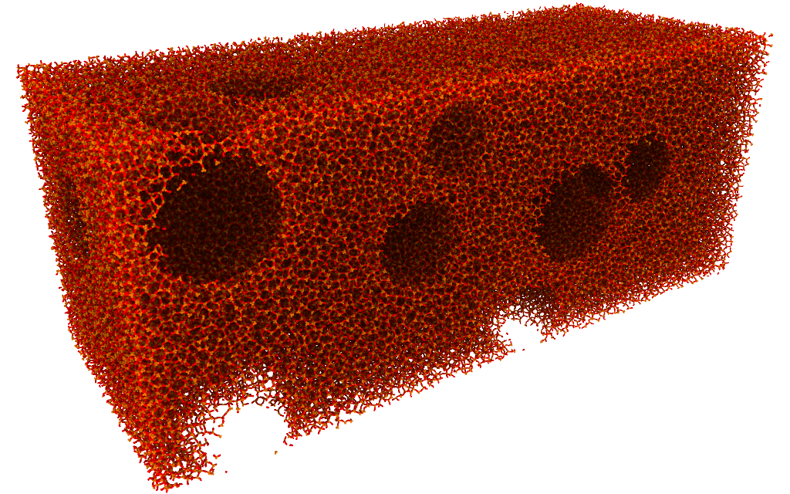
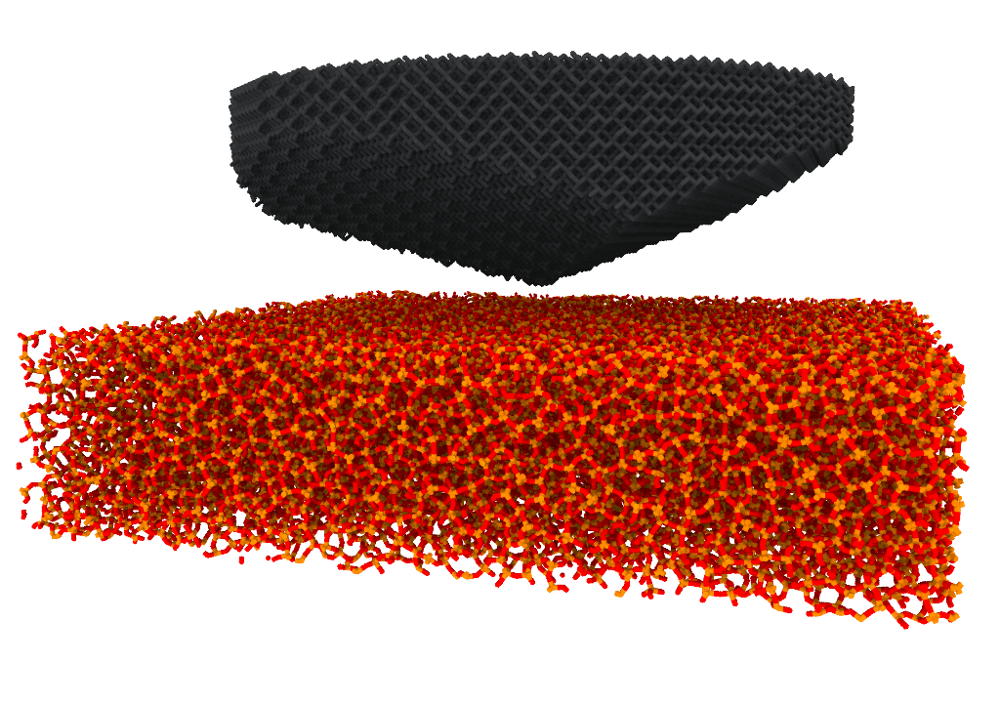

# Molecular builder 

This builder relies heavily on the atomic simulation environment (ase). I particular we use ase to generate crystals from space group descriptions. 

This molecular builder is made with LAMMPS in mind. Usually, saving to input files for other simulators will work just fine, but anywhere a choice has to be made, convenience when preparing systems for LAMMPS will be prioritized. 

## Description
This package facilitates building molecular systems. It has functions for creating bulk crystals and for fetching periodic boxes of non-crystalline systems from the internet. After generating bulk crystals, the user may carve out specific geometries, and combine several elements to create a system. 

We also support adding water using packmol. This requires having packmol installed. 

## Installation 
```
pip install git+https://github.com/henriasv/molecular-builder 
```

## Usage
Simple use case for creating a bulk alpha-quartz crystal. 
```python 
from molecular_builder import create_bulk_crystal
atoms = create_bulk_crystal("alpha_quartz", [50,100,200])
atoms.write("alpha_quartz.data", format="lammps-data")
```

More advanced use case for carving out randomly placed and saving the carved out atoms and the resulting system in different files. In this example, the bulk system is retrieved from a repository. 
```python 
from molecular_builder import create_bulk_crystal, carve_geometry, fetch_prepared_system
from molecular_builder.geometry import SphereGeometry
import numpy as np 

atoms = fetch_prepared_system("amorphous_silica_1")

num_spheres = 20

geometries = [SphereGeometry(np.asarray([i*357,j*143,k*143]), 
                                r*30,
                                periodic_boundary_condition=(True, True, True)) for i,j,k,r in np.random.uniform(size=(num_spheres,4))] 

num_carved = 0
for geometry in geometries:
    tmp_carved = carve_geometry(atoms, geometry, side="in")
    print(f"tmp carved: {tmp_carved}")
    num_carved += tmp_carved

print(f"Carved out {num_carved} atoms")

atoms.write("block_with_holes.data", format="lammps-data")

```
This script should output a structure resembling this:  


### Indentation
Use case for setting up a system with a Berkovich indenter with atoms in a diamond structure, above a slab of amorphous silica. 
```python 
from molecular_builder import create_bulk_crystal, carve_geometry, fetch_prepared_system
from molecular_builder.geometry import BerkovichGeometry, CylinderGeometry

slab = fetch_prepared_system("vashishta_1990_like_amorphous_silica/quench_950K")
slab.cell[2,2] = 80 # Expand cell in z direction to fit indenter 

indenter = create_bulk_crystal("diamond", (144, 144, 80), round="down")
carve_geometry(indenter, BerkovichGeometry((75, 75, 40)), side="out")
carve_geometry(indenter, CylinderGeometry((75, 75, 50), 60, 200, orientation=(0,0,1)), side="out")

atoms = slab+indenter

atoms.write("indenter_and_glass.data", format="lammps-data")

```
This results in the following system:


Use case for retrieving a particular input structure from a repository. The name of the structure contains an identifier, in this case `p3754` that can be traced back to the procedure for creating the structure. For amorphous silica, this will typically be the melting and annealing process. 
```python 
atoms = fetch_prepared_system("amorphous_silica_p3754", [100,100,100])
atoms.save("my_amorphous_silica.data")
```

## Decisions to be made 
- Support periodic boundary conditions? If we are to, we need to have an on/off switch for this in the carve function, since some geometries, like notches, will behave poorly with periodic boundary conditions. 
- When adding atoms abject, which cell takes precendent? How to combine the cells of two atoms objects? 

