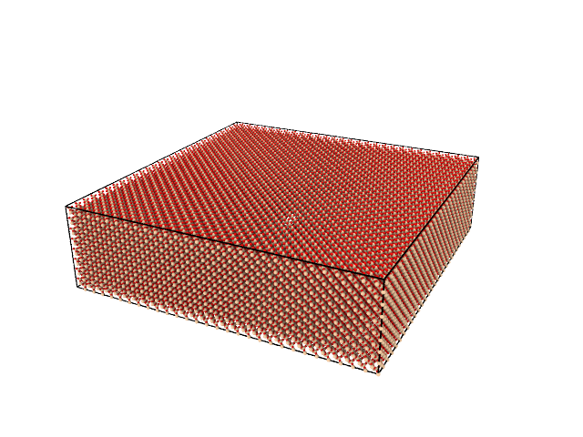

Generating surfaces with procedural noise
=========================================

The `ProceduralSurfaceGeometry`-class is a child of the `Geometry` class, and carves out a procedural surface of a already existing object. We will here present a basic example where we carve out a procedural surface from a block of beta-cristobalite.

First, we need to import necessary functionality:

.. literalinclude:: proceduralsurface.py
    :lines: 1-2

Second, a block of beta-cristobalite is generated. We go with a block of dimensions (50Å, 200Å, 200Å).

.. literalinclude:: proceduralsurface.py
    :lines: 5

    A block of :math:`\beta`-cristobalite.

Basic example
-------------
A basic example would be to

The code below will carve out the desired surface:

.. literalinclude:: proceduralsurface.py
    :lines: 9-14

The result is

.. figure:: block_with_procedural_surface.png

    Procedurally generated surface

If the result is not satisfying, there are several parameters that can be changed. `octaves` is the level of details and `scale` is the scale of the structures. You should also consider changing the seed. See `the noise documentation
<https://pypi.org/project/noise/>`_. for more options.

Full code of this example:

.. literalinclude:: proceduralsurface.py
