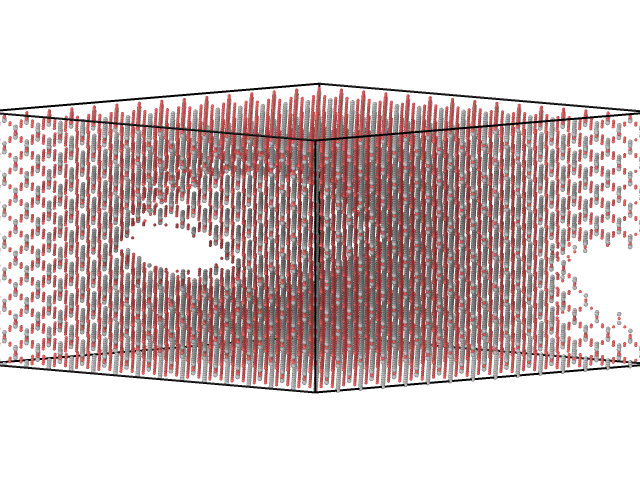

Generating procedural surfaces
==============================

"_Perlin noise is a type of gradient noise developed by Ken Perlin in 1983 as a result of his frustration with the "machine-like" look of computer-generated imagery (CGI) at the time._" The main purpose was to generate realistic landscape for the Disney movie "Tron". After that, Perlin noise has been ubiquitous in CGI. In 2001, Ken Perlin introduced a improved procedural noise, named simplex noise, based on a simplex grid instead of a square grid. Our implementation of the procedural surface geometry relies on the noise library in Python. There, all the expensive operations are written in C++, making the function extremely fast despite a double loop.

The `ProceduralSurfaceGeometry`-class is a child of the `Geometry` class, and carves out a procedural surface of a already existing object. We will here present a basic example where we carve out a procedural surface from a block of beta-cristobalite.

First, we need to import the necessary stuff:

.. literalinclude:: proceduralsurface.py
    :lines: 1-2

Second, a block of beta-cristobalite needs to be generated. We go with a block of dimensions (50Å, 200Å, 200Å).

.. literalinclude:: proceduralsurface.py
    :lines: 5

.. figure:: block.png

    A block of :math:`\beta`-cristobalite.

Before we carve out the procedural surface, we will list the arguments to the `ProceduralSurfaceGeometry`-class with a short explanation. The class takes the arguments `point`, `normal`, `thickness`, `scale`, `method` and `f`, in addition to all arguments that can be passed to the `pnoise3` and `snoise3` functions of the `noise` library. `point` is an equilibrium point of the noise, `normal` is the normal vector of the plane defining all the equilibrium points, `thickness` is the thickness of the noise, `scale` is the scale of the noise, `method` is either '`perlin`' or '`simplex`' and `f` is an arbitrary 3d function that is added to the noise.

The code below will carve out the desired surface:

.. literalinclude:: proceduralsurface.py
    :lines: 9-14

The result is

.. figure:: block_with_procedural_surface.png

    Procedurally generated surface

If the result is not satisfying, there are several parameters that can be changed. `octaves` is the level of details and `scale` is the scale of the structures. You should also consider changing the seed. See `the noise documentation
<https://pypi.org/project/noise/>`_. for more options.

Full code of this example:

.. literalinclude:: proceduralsurface.py

Generating procedural slabs
===========================

The `ProceduralSlabGeometry`-class is functionally very similar to `ProceduralSurfaceGeometry`. The difference is that `ProceduralSlabGeometry` can be used to carve out atoms inside a material while leaving the surface of the material intact.

The class takes the same input parameters as `ProceduralSurfaceGeometry`. Below is an example demonstrating how to carve out procedural structures inside a block of beta-cristobalite:

.. literalinclude:: proceduralslab.py

Result:

    Procedurally generated slab
