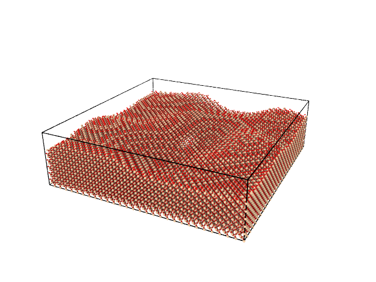

Generating surfaces with procedural noise
=========================================

The `ProceduralSurfaceGeometry`-class is a child of the `Geometry` class, and carves out a procedural surface of a already existing object. We will here present a basic example where we carve out a procedural surface from a block of beta-cristobalite.

First, we need to import necessary functionality:

.. literalinclude:: generate.py
    :lines: 1-2

Second, a block of beta-cristobalite is generated. We go with a block of dimensions (50Å, 200Å, 200Å).

.. literalinclude:: generate.py
    :lines: 5

    A block of :math:`\beta`-cristobalite.

Basic example
-------------
To get a basic surface with structures generated by procedural noise, we need to define a point on the surface, its normal vector and the thickness of the noise:

.. literalinclude:: basic.py
    :lines: 8-12

The result is

    Surface with procedural structures generated using Perlin noise. Scale is 1, octaves is 1.

Noise parameters
----------------
There is a bunch of parameters associated with the procedural noise. The scale of the noise structures is given by the `scale`-parameters, and the number of octaves (levels of details) is given by `octaves`. To generate different surfaces with the same parameters, change `seed`. See <https://pypi.org/project/noise/>`_. for more options.

.. literalinclude:: parameters.py
    :lines: 8-16

The result is

.. figure:: parameters.png

    Surface with procedural structures generated using Simplex noise. Scale is 3, octaves is 2.

Two-level surface
----------------
Instead of having continuous surfaces, one may wants to set a threshold and create a two-level surface. As the expectation value of the noise is zero, setting `threshold=0` gives a surface where the surface area of the two levels is approximately the same.

.. literalinclude:: two_level.py
    :lines: 8-17

The result is

.. figure:: two_level.png

    Surface with two-level structures generated using Simplex noise. Scale is 3, octaves is 2.

Periodic structures
-------------------
Often it is convenient to have periodic structures. By setting `repeat=True`, the structures are repeated once in each direction:

.. literalinclude:: periodic.py
    :lines: 8-18

The result is

.. figure:: periodic.png

    Surface with periodic two-level structures. Scale is 3, octaves is 2.

One can also set how often the structures should repeat. By setting `repeat=(100, 200)`, the structures are repeated twice in x-direction and once in y-direction:

.. literalinclude:: periodic2.py
    :lines: 8-18

The result is

.. figure:: periodic2.png

    Surface with periodic two-level structures. Scale is 3, octaves is 2.

Screwed noise
-------------
Another possibility is to make the noise screwed. This is done by setting the relative angle between the x-axis and the noise axis, which by default in 90 degrees. This can be useful when dealing with triclinic systems:

.. literalinclude:: screwed.py
    :lines: 8-19

The result is

.. figure:: screwed.png

    Surface with periodic, screwed two-level structures. Scale is 3, octaves is 2.

Add function
------------
A function can be added to the noise. Here, we add a fucntion that is lineary increasing when x<100 and a lineary decreasing when x>100:

.. literalinclude:: add_function.py
    :lines: 9-13

Then, we set `f=f`:

.. literalinclude:: add_function.py
    :lines: 17-28

The result is

.. figure:: add_function.png

    Surface with periodic two-level structures and an added function. Scale is 3, octaves is 2.
