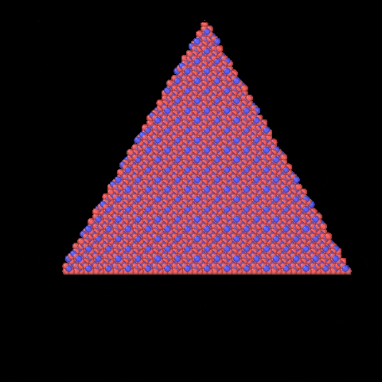

# The ```PlaneGeometry``` class
We will here demonstrate the power of the ```PlaneGeometry``` class. The class takes the two arguments: ```point``` and ```normal```, where the former is a point on a plane and the latter is the normal vector of the plane. What makes the geometry powerful is that it can take an arbitrary number of planes, making it able to represent _any_ geometry with plane sides. We will here show how it can be used to carve out polygons (with a height). 

## 3d polygons
We name polygons with a height - a 3d polygon. A prism is an examples of such a geometry. To carve out such a geometry, we need to know the normal vector and a point on all the sides. For equilateral polygons, this can easily be found using the unit circle. The normal vector of any point on the unit circle is (sin(θ), cos(θ)). If we say that each side of our polygon is a tangent of the unit circle, (sin(θ), cos(θ)) is both the normal vector and a point on each of those sides. 

To implement this, we first need to import the required methods and create a block of some substance (here beta-cristobalite):
``` python
from molecular_builder import create_bulk_crystal, carve_geometry
from molecular_builder.geometry import PlaneGeometry

atoms = create_bulk_crystal("beta_cristobalite", [120, 120, 120])
```

We then need to define the type, scale and location of the polygon. We go with a pentagon with a scale 30 relative to the unit circle and centred in (60, 60):
``` python
num_sides = 5
scaling = 30
center = (60, 60, 0)
```

Furthermore, the normal vectors and points on all the planes are defined by
``` python
import numpy as np
thetas = np.linspace(0, 2*np.pi, num_sides+1)[:-1]
normals = [np.sin(thetas), np.cos(thetas), np.zeros(num_sides)]
normals = np.asarray(normals).T
points = scaling * normals + center
```

Finally, the pentagon can easily be carved out using
``` python
geometry = PlaneGeometry(points, normals)
num_carved, carved = carve_geometry(atoms, geometry, side="in", return_carved=True)
```

This can easily be generalized to other polynomials as well. Below, we present an animation of what a carved trigon, tetragon, pentagon, heksagon, heptagon, oktagon, enneagon and dekagon looks like.


