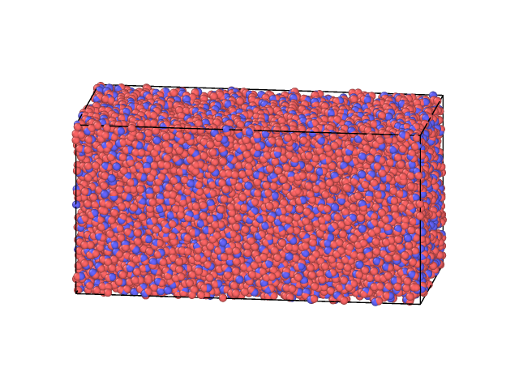
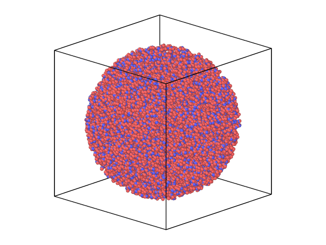

# Pack pure water
For pure water simulations, we need to be able to pack pure water. This can be done by the ```pack_water``` method. Below, we demonstrate how to pack 10000 water molecules in a spherical shape and in a box shape, but all the available geometries can be used.

First, we need to import ```pack_water``` and the desired geometries:
``` python
from molecular_builder import pack_water
from molecular_builder.geometry import BoxGeometry, SphereGeometry
```

## Box geometry
The box geometry takes the center of the box and the box length as arguments. We also print the positions out to file, such that we can visualize the water using for instance Ovito. 
``` python
water = pack_water(10000, geometry=BoxGeometry((50,25,25), (100,50,50)))
water.write("water_box.data", format="lammps-data")
```

The water is then packed in a box of length (100Å, 50Å, 50Å):



## Sphere geometry
The sphere geometry takes the center of the sphere and the radius as arguments. We also print the positions out to file, such that we can visualize the water using for instance Ovito. 
``` python
water = pack_water(10000, geometry=SphereGeometry((50,50,50), 50))
water.write("water_sphere.data", format="lammps-data")
```

The water is then packed in a sphere of radius 50 Å:


