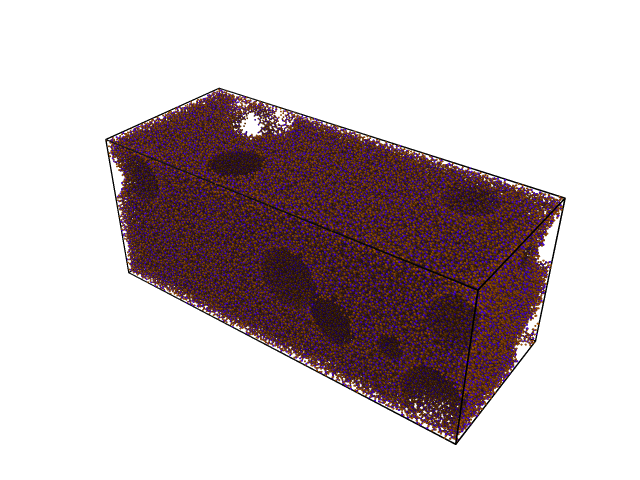
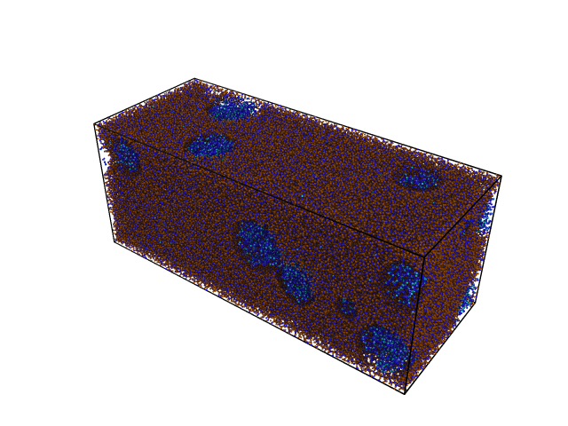
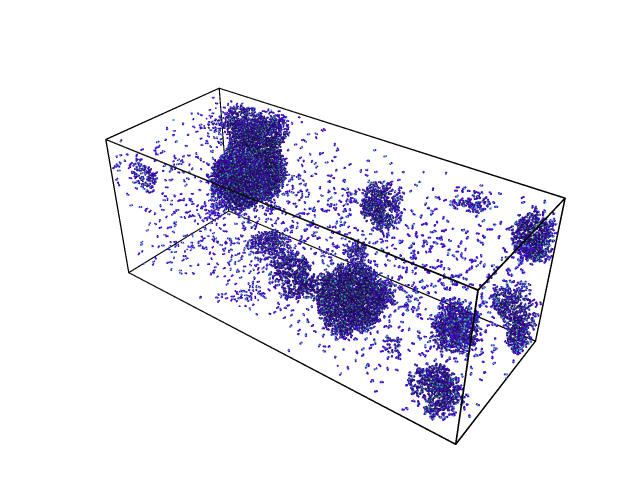

# Pack water in voids
In this example, we first carve spherical holes in a block of amorphous silica, and then we fill the voids with water. 

First, we need to import the required functions. The ```fetch_prepared_system``` function is used to fetch a prepared amorphous silica block. We use the ```carve_geometry``` function is carve spherical holes. The ```pack_water``` function is used to pack water in the holes.  We need NumPy's ```random``` module to choose geometries randomly.
``` python
import numpy import random
from molecular_builder import fetch_prepared_system, carve_geometry, pack_water
from molecular_builder.geometry import SphereGeometry
```

## Amorphous silica block with holes
Furthermore, the silica block is fetched and carved:
``` python
amorph = fetch_prepared_system("amorphous_silica_1")

num_spheres = 20
for sphere in range(num_spheres):
    i, j, k, l = random.uniform(size=4)
    x, y, z, r = i*357, j*143, k*143, l*50
    geometry = SphereGeometry((x, y, z), r, periodic_boundary_condition=(1, 1, 1))
    tmp_carved = carve_geometry(amorph, geometry, side="in")
    print(f"tmp carved: {tmp_carved}")
    
amorph.write("amorph.data", format="lammps-data")
```

The output is presented below:



## Fill holes with water
The voids are filled with 10000 water molecules:

``` python
water = pack_water(nummol=10000, atoms=amorph)
system = water + amorph
system.write("system.data", format="lammps-data")
water.write("water.data", format="lammps-data")
```

Here is the final system:



and the water alone:


